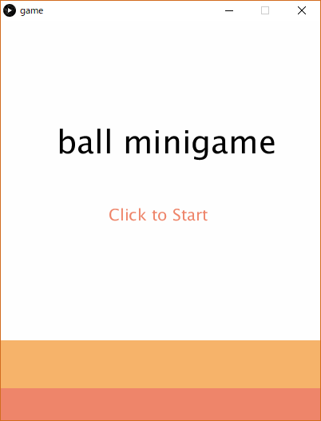
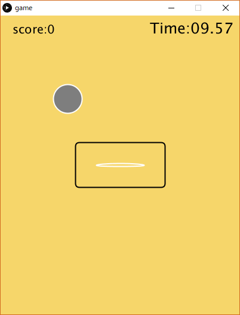
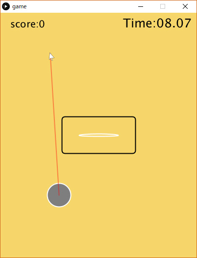
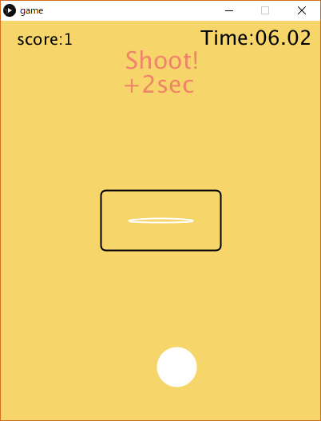

# processingGame
processingによるバスケットボールミニゲーム

## ファイル
ソースコードはgameフォルダ直下のgame.pdeというファイルです。processingを実行する環境をお持ちの方は、このコードを実行することでゲームをプレイすることができます。
またprocessingを持っていない場合でも、実行ファイルを用意しているので遊ぶことができます。application.windows64とapplication.windows32というフォルダにそれぞれ64bit版、32bit版のwindowsで遊ぶことができる実行ファイルが入っています。お手持ちのPCに合わせた方のexeファイルをダブルクリックすることでプレイできます。

## ゲームの説明  
タイトル画面  
  
この画面で左クリックをするとゲームが始まります。ゲームが始まると次に示す画像のように、ボールが落下してきます。このボールを中央の白い輪にシュートしてください。制限時間は右上に表示されており、段々と減っていきます。  
  
ボールを操作するには左クリックしてください。左クリックをしている間はこのように赤い線が現れます。左クリックを離すとボールが線の伸びる方向に動きます。  
  
うまく操って、中央のゴールに上からシュートしてください。シュートに成功するとボールが白くひかり、左上のスコアが加算されます。さらに、制限時間に2秒加算されます。  
  
シュートを素早く入れてプレイ時間を延ばし、スコアを伸ばしましょう！という簡単なゲームなので良かったら遊んでみてください。  